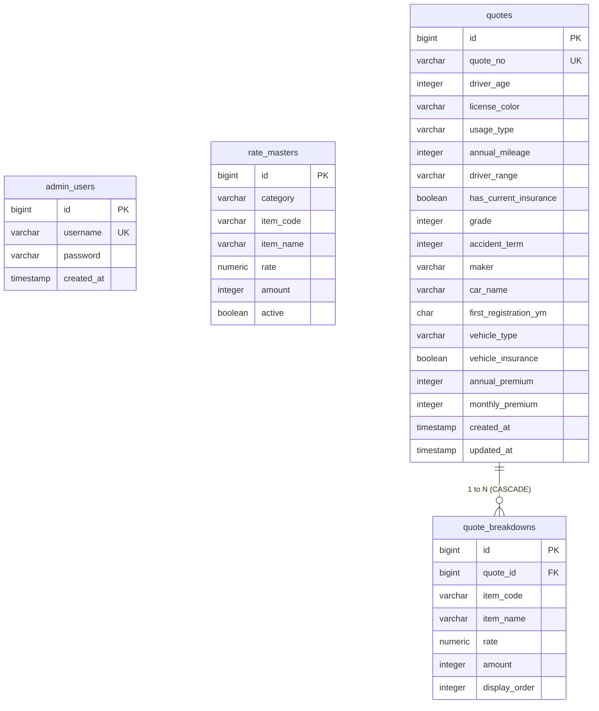

# データベース設計仕様およびDDL定義書

本書は、自動車保険見積システムで使用するデータベース（PostgreSQL 16）のテーブル設計、リレーション、インデックス設計、および初期配置DDLについてまとめた交付文書（提出物）です。

---

## 1. データベース設計概要

本システムでは、見積の条件入力から料金算出、および管理者による過去の見積履歴検索・CSV出力をサポートするため、正規化された4つのテーブルで構成されています。

### データベース基本設定
* **RDBMS**: PostgreSQL 16
* **データベース名**: `quotesdb`
* **ユーザー名**: `quoteuser`

---

## 2. ER図 (Entity Relationship Diagram)

テーブル間のリレーションは以下の通りです。見積ヘッダ（quotes）と見積明細（quote_breakdowns）の間には、強固な親子の「1対多」リレーションが結ばれています。



---

## 3. テーブル定義書 (Data Dictionary)

### ① 管理者ユーザーテーブル (`admin_users`)
管理システムにログインする管理アカウント情報を保持します。

| 論理名 | 物理カラム名 | データ型 | PK/UK | NULL | デフォルト値 | 説明・設計ノート |
|---|---|---|---|---|---|---|
| ID | `id` | BIGSERIAL | PK | NG | - | 自動採番される内部ID。 |
| 管理者ID | `username` | VARCHAR(50) | UK | NG | - | ログインに使用する一意のユーザー名。 |
| 暗号化パスワード | `password` | VARCHAR(100) | - | NG | - | アプリケーション側で暗号化（BCryptハッシュ化）されたパスワード。 |
| 作成日時 | `created_at` | TIMESTAMP | - | NG | `CURRENT_TIMESTAMP` | ユーザーの作成日時。 |

### ② 料率マスタテーブル (`rate_masters`)
見積計算で使用される年齢、等級、特約などの各種係数および加算額を保持するデータ駆動設計用のテーブルです。

| 論理名 | 物理カラム名 | データ型 | PK/UK | NULL | デフォルト値 | 説明・設計ノート |
|---|---|---|---|---|---|---|
| ID | `id` | BIGSERIAL | PK | NG | - | 自動採番される内部ID。 |
| マスタ区分 | `category` | VARCHAR(50) | - | NG | - | `AGE`, `LICENSE`, `USAGE` などの区分コード。 |
| 項目キー | `item_code` | VARCHAR(50) | - | NG | - | `18_25`, `GOLD`, `PRIVATE` などの項目キー。 |
| マスタ項目名 | `item_name` | VARCHAR(100) | - | NG | - | 「18〜25歳」「日常・レジャー用」などの表示名。 |
| 乗算係数 | `rate` | NUMERIC(6,3) | - | OK | - | 小数点以下3桁精度の乗算倍率。 |
| 加算額 | `amount` | INTEGER | - | OK | - | 特約適用時の固定加算額（日本円）。 |
| 有効フラグ | `active` | BOOLEAN | - | NG | `TRUE` | 論理削除または有効/無効の制御用。 |

### ③ 見積ヘッダテーブル (`quotes`)
利用者が入力した見積条件と、その結果として算出された年間/月額保険料を保存します。

| 物理カラム名 | データ型 | PK/UK | NULL | 説明・設計ノート |
|---|---|---|---|---|
| `id` | BIGSERIAL | PK | NG | 自動採番される内部ID。 |
| `quote_no` | VARCHAR(20) | UK | NG | 採番形式: `ESTyyyyMMdd0001`（一意キー）。 |
| `driver_age` | INTEGER | - | NG | 運転者の年齢（18〜100）。 |
| `license_color` | VARCHAR(20) | - | NG | 運転免許証の色（GOLD/BLUE/GREEN）。 |
| `usage_type` | VARCHAR(20) | - | NG | 主な使用目的（PRIVATE/COMMUTE/BUSINESS）。 |
| `annual_mileage` | INTEGER | - | NG | 年間予定走行距離（0〜30000）。 |
| `driver_range` | VARCHAR(20) | - | NG | 運転者限定範囲（SELF/COUPLE/FAMILY/ANYONE）。 |
| `has_current_insurance`| BOOLEAN | - | NG | 現在加入中の自動車保険があるか。 |
| `grade` | INTEGER | - | OK | 現在加入ありの場合の等級（1〜20）。 |
| `accident_term` | INTEGER | - | OK | 事故有係数適用期間（0〜6）。 |
| `maker` | VARCHAR(50) | - | NG | 自動車メーカー名（50文字以内）。 |
| `car_name` | VARCHAR(50) | - | NG | 車名（50文字以内）。 |
| `first_registration_ym`| CHAR(7) | - | NG | 形式「`YYYY-MM`」固定のため固定長を採用。 |
| `vehicle_type` | VARCHAR(20) | - | NG | 車両タイプ（COMPACT/SEDAN/MINIVAN/SUV/KEI）。 |
| `vehicle_insurance` | BOOLEAN | - | NG | 車両保険付加の有無。 |
| `annual_premium` | INTEGER | - | NG | 算出された年間保険料（10円未満四捨五入）。 |
| `monthly_premium` | INTEGER | - | NG | 算出された月額保険料（10円未満四捨五入）。 |
| `created_at` | TIMESTAMP | - | NG | 見積作成日時（監査・履歴追跡用）。 |
| `updated_at` | TIMESTAMP | - | NG | 更新日時。 |

### ④ 見積明細テーブル (`quote_breakdowns`)
見積計算時、実際に適用された個別の補正係数や加算金額の内訳明細を記録します。

| 論理名 | 物理カラム名 | データ型 | PK/UK | NULL | 説明・設計ノート |
|---|---|---|---|---|---|
| ID | `id` | BIGSERIAL | PK | NG | 自動採番される内部ID。 |
| 見積ID | `quote_id` | BIGINT | FK | NG | `quotes.id` を参照する外部キー（`ON DELETE CASCADE`）。 |
| 適用キー | `item_code` | VARCHAR(50) | - | NG | 適用された料率項目コード。 |
| 明細表示名 | `item_name` | VARCHAR(100) | - | NG | 「年齢（18〜25歳）」「対物無制限加算」などの内訳表示用。 |
| 適用係数 | `rate` | NUMERIC(6,3) | - | OK | 適用された乗算値（未適用時はNULL）。 |
| 適用額 | `amount` | INTEGER | - | OK | 適用された加算値（未適用時はNULL）。 |
| 表示順 | `display_order` | INTEGER | - | NG | 画面での表示順序（インサート順）。 |

---

## 4. インデックス設計意図 (Performance & Scalability)

データベースの参照速度を高速化し、将来の履歴増大に対応するために以下のインデックスを設定しています。

1. **`idx_rate_masters_lookup`**: 
   * 設計: `ON rate_masters(category, item_code) WHERE active = TRUE`
   * 意図: 見積の算出処理においてマスタテーブルは高頻度に読込まれます。有効な（active=TRUE）レコードのみをインデックスの対象とすることで、インデックスのファイルサイズを削減しつつ極小のディスクI/Oで合致レコードを特定します。
2. **`idx_quotes_no`**:
   * 設計: `ON quotes(quote_no)`
   * 意図: ユーザーが見積完了画面を表示する際や管理者が詳細画面を表示する際、見積番号による一意検索の応答速度を極限まで高めます。
3. **`idx_quotes_created_at`**:
   * 設計: `ON quotes(created_at)`
   * 意図: 管理者画面での「最近の見積順」ソートや日付検索、月次集計クエリのソート処理負荷を低減します。
4. **`idx_quote_breakdowns_quote`**:
   * 設計: `ON quote_breakdowns(quote_id)`
   * 意図: 見積詳細表示の際、親子関係にある明細データを1クエリでスムーズに取得できるようにするための外部キーインデックスです。

---

## 5. DDLスクリプト (SQL定義)

以下は、コンテナ起動時にデータベースの初期構築に使用される `01_schema.sql` の内容です。

```sql
-- DDLソースコード
-- (c:/Users/26329/Desktop/TaSProject/docker/db/init/01_schema.sql からの抜粋)
CREATE TABLE IF NOT EXISTS admin_users (
    id BIGSERIAL PRIMARY KEY,
    username VARCHAR(50) UNIQUE NOT NULL,
    password VARCHAR(100) NOT NULL,
    created_at TIMESTAMP NOT NULL DEFAULT CURRENT_TIMESTAMP
);

CREATE TABLE IF NOT EXISTS rate_masters (
    id BIGSERIAL PRIMARY KEY,
    category VARCHAR(50) NOT NULL,
    item_code VARCHAR(50) NOT NULL,
    item_name VARCHAR(100) NOT NULL,
    rate NUMERIC(6,3),
    amount INTEGER,
    active BOOLEAN NOT NULL DEFAULT TRUE
);

CREATE INDEX IF NOT EXISTS idx_rate_masters_lookup ON rate_masters(category, item_code) WHERE active = TRUE;

CREATE TABLE IF NOT EXISTS quotes (
    id BIGSERIAL PRIMARY KEY,
    quote_no VARCHAR(20) UNIQUE NOT NULL,
    driver_age INTEGER NOT NULL,
    license_color VARCHAR(20) NOT NULL,
    usage_type VARCHAR(20) NOT NULL,
    annual_mileage INTEGER NOT NULL,
    driver_range VARCHAR(20) NOT NULL,
    has_current_insurance BOOLEAN NOT NULL,
    grade INTEGER,
    accident_term INTEGER,
    maker VARCHAR(50) NOT NULL,
    car_name VARCHAR(50) NOT NULL,
    first_registration_ym CHAR(7) NOT NULL,
    vehicle_type VARCHAR(20) NOT NULL,
    vehicle_insurance BOOLEAN NOT NULL,
    annual_premium INTEGER NOT NULL,
    monthly_premium INTEGER NOT NULL,
    created_at TIMESTAMP NOT NULL DEFAULT CURRENT_TIMESTAMP,
    updated_at TIMESTAMP NOT NULL DEFAULT CURRENT_TIMESTAMP
);

CREATE INDEX IF NOT EXISTS idx_quotes_no ON quotes(quote_no);
CREATE INDEX IF NOT EXISTS idx_quotes_created_at ON quotes(created_at);

CREATE TABLE IF NOT EXISTS quote_breakdowns (
    id BIGSERIAL PRIMARY KEY,
    quote_id BIGINT NOT NULL REFERENCES quotes(id) ON DELETE CASCADE,
    item_code VARCHAR(50) NOT NULL,
    item_name VARCHAR(100) NOT NULL,
    rate NUMERIC(6,3),
    amount INTEGER,
    display_order INTEGER NOT NULL
);

CREATE INDEX IF NOT EXISTS idx_quote_breakdowns_quote ON quote_breakdowns(quote_id);
```

---
以上
